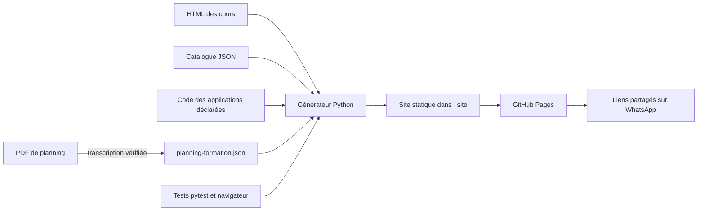

# Architecture et décisions

## Décisions actées

- Hébergement : GitHub Pages, validé par l'utilisateur.
- Sources pédagogiques : HTML existants, révisés par l'utilisateur indépendamment du code.
- Base de contenus : catalogue JSON versionné. Suffisant pour un ensemble croissant de cours statiques ; aucune base SQL n'est requise.
- Génération : Python standard ; dépendances d'exécution absentes. `uv` gère Python, pytest et l'outillage navigateur.
- Interface : HTML/CSS/JavaScript natifs, avec navigation disponible sans JavaScript. La recherche et le partage sont des améliorations progressives.



## Organisation

```text
AGENTS.md                  règles pour les prochaines interventions
catalogue-cours.json        matières, cours, statuts et parcours
planning-formation.json     phases, sujets, séances et PDF déclarés
Planning/                  plannings sources locaux, ignorés par Git
Cours/<matière>/           sources HTML et documents, rangés par matière
applications/              jeux et simulateurs : code, tests et documentation propres
wiki/catalogue.py          validation et extraction des sections
wiki/planning.py           validation et rendu de la frise
wiki/build.py              génération et contrôle des liens
wiki/maintenance.py        intégration validée et publication des contenus
wiki/routine.py            assistant et aperçu local
wiki/__main__.py           commandes du site et de maintenance
Mettre-a-jour.cmd           entrée Windows vers le menu uv
docs/MISE_A_JOUR.md         routine de réception et publication
assets/                    interface commune, recherche et partage
tests/                    tests de comportement du catalogue et du build
tests/browser/            quelques parcours de bout en bout
docs/STORIES.md            critères d'acceptation et état des stories
.github/workflows/         tests et publication GitHub Pages
pyproject.toml / uv.lock   environnement reproductible
_site/                    résultat local ignoré par Git
```

## Contrat de contenu

Les identifiants sont internes au wiki, pas des numéros officiels IWE. Les noms de matières ne sont jamais codés en dur dans le générateur. Les cours à venir sont distincts des brouillons : le premier état annonce une suite, le second exclut la ressource de la publication.

`fichier` identifie la source dans `Cours/<matière>/` ; `url` identifie la destination stable. Le déplacement des sources ne change pas les adresses publiques `RDM/…` et `Metallurgie/…`, ni les liens déjà partagés. Cette séparation répond au remplacement des fichiers RDM pendant l'édition : le nom d'un export peut changer sans modifier l'adresse partagée. La navigation entre cours est calculée selon l'ordre dans la matière ; les prérequis et parcours peuvent traverser les matières.

Le catalogue conserve les informations éditoriales stables. Les titres de sections et ancres sont extraits du HTML à chaque génération. Les liens de parcours sont contrôlés contre les identifiants réellement présents. La recherche initiale porte sur les titres, sections, matières et mots-clés ; l'indexation intégrale du texte pourra être ajoutée si les usages le demandent.

## Isolation des cours

Le générateur lit les sources et enrichit leurs copies avec une navigation commune. Il conserve les scripts et styles pédagogiques ; les styles communs utilisent les classes `wiki-*` et le portail `.wiki-shell`. Les fichiers `planning.css` et `planning.js` sont chargés uniquement sur la page de frise. Chaque cours reste dans son document, ce qui évite les collisions entre les nombreuses variables, identifiants et canvas des cours.

L'accueil et les pages matière sont préconstruits. Aucun routeur JavaScript, chargement des cours en iframe ou application monopage n'est nécessaire. Les liens relatifs préservent le fonctionnement sous le nom du dépôt GitHub Pages.

Les sorties sont reconstruites depuis les seules entrées disponibles et leurs fichiers associés. Le générateur refuse de nettoyer une sortie non marquée ou un lien/jonction vers un autre dossier. Les fichiers associés doivent être déclarés ; les dépendances HTML manquantes bloquent le build. La validation ne prétend pas analyser tous les chargements dynamiques possibles à l'intérieur du JavaScript pédagogique.

## Applications interactives

Une application (jeu, simulateur) est du code, pas un support éditorial : ses sources vivent dans `applications/<id>/` avec leurs propres tests et leur documentation. Le catalogue la déclare dans la liste `applications` : matière, état, `fichiers` publiés un à un, dossier de `publication`, `cours_lies`. Le générateur copie seulement ces fichiers et enrichit la copie de la page d’entrée avec la barre du wiki. Les routes internes par ancre (`#laboratoire`, `#histoire/3`) sont reconnues grâce à la balise `wiki-application` et ne passent pas au contrôle des sections.

Place volontairement secondaire : section « S’entraîner » de la matière, lien en pied des cours liés, entrée de recherche ; l’accueil ne montre que le nombre d’applications dans la carte de la matière. Aucune matière n’est codée en dur. La routine de maintenance construit ses sites candidats avec le code déclaré des applications, mais `publier` ne l’embarque jamais. Le premier cas est Mohr Forge, publié à `RDM/mohr-forge/` ; son ancien dépôt autonome est archivé localement dans `.sauvegardes/`.

La CI teste les moteurs des applications avec Node 24, sans npm, puis leurs parcours Chromium avant de publier.

## Planning

La frise est préconstruite à partir de `planning-formation.json` ; son analyse et ses rapprochements éditoriaux sont documentés dans [PLANNING.md](PLANNING.md). Les sources sont référencées mais leurs PDF restent locaux (`publier: false`, comportement par défaut). Le build n'exige alors pas ces fichiers en CI. Une publication ultérieure demanderait l'autorisation explicite du propriétaire puis `publier: true` pour chaque PDF autorisé ; seuls ces fichiers seraient copiés. Les dépendances d'analyse PDF utilisées ponctuellement via uv ne sont pas nécessaires à la génération ni à la CI.

Les semaines ISO sont calculées en Python ; dans le navigateur, les filtres masquent les cartes et le repère actuel utilise l'heure de Paris. Les paramètres d'URL et ancres restaurent la vue, y compris une semaine future. Sans JavaScript, les semaines restent des éléments `details` consultables et les liens restent ordinaires. Le planning est facultatif pour les catalogues de test qui n'en possèdent pas.

## Harness proportionné

Une seule suite pytest rapide et quelques parcours Chromium. Aucun framework frontend, conteneur Docker, serveur API, authentification, collecte de données ou métrique de couverture imposée. Les commandes CI sont les mêmes que celles de la documentation locale. Les tests protègent les invariants qui coûtent cher à perdre : adresses stables, sources intactes, absence de contenu non déclaré et navigation utilisable.

Le dépôt public est Pemcode/PolyWE ; le site est publié à https://pemcode.github.io/PolyWE/. GitHub Pages utilise GitHub Actions, avec `PAGES_ENABLED=true`. Chaque push sur `main` déclenche les contrôles puis le déploiement ; les pull requests exécutent seulement les contrôles et la construction. Les comptes, synchronisation de progression, statistiques collectives et mode hors connexion sont hors du premier lot ; ils restent des stories distinctes si un besoin apparaît.

## Routine de maintenance

L’assistant est local et utilise Python standard, Git et uv. Il inscrit les HTML existants sans les déplacer ni les réécrire. Pour un PDF ou un document Office, il crée une page HTML dans `Supports/` et déclare le fichier original comme ressource associée : aucun second modèle de catalogue n’est nécessaire. La navigation, la frise, la recherche et le partage réutilisent le générateur. Les documents sont cherchables par leurs métadonnées, pas par leur texte intégral.

Avant tout enregistrement, un build dans un dossier temporaire valide le catalogue candidat, le planning et les fichiers déclarés. Les originaux, les métadonnées et `_site/` ne sont pas touchés en cas d’erreur de validation. Une entrée annoncée conserve son identité et son adresse. Le HTML d’accès d’un document devient une source versionnée ; il n’est pas réécrit lors des corrections du document.

La commande `publier` exécute les tests Python et le build puis sélectionne explicitement les contenus disponibles et les JSON. Elle refuse un index Git prérempli, les modifications suivies hors contenu, une branche autre que `main`, un retard sur GitHub ou des commits locaux contenant d’autres fichiers, y compris dans l’historique intermédiaire. Après affichage et confirmation, elle committe et pousse ; un échec du push laisse un commit réutilisable. Les parcours navigateur restent obligatoires en CI avant déploiement. Le circuit de développement garde les commits manuels pour le code et la documentation.
