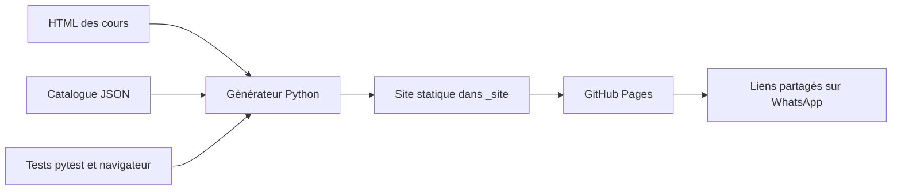

# Architecture et décisions

## Décisions actées

- Hébergement : GitHub Pages, validé par l'utilisateur.
- Sources pédagogiques : HTML existants, révisés par l'utilisateur indépendamment du code.
- Base de contenus : catalogue JSON versionné. Suffisant pour un ensemble croissant de cours statiques ; aucune base SQL n'est requise.
- Génération : Python standard ; dépendances d'exécution absentes. `uv` gère Python, pytest et l'outillage navigateur.
- Interface : HTML/CSS/JavaScript natifs, avec navigation disponible sans JavaScript. La recherche et le partage sont des améliorations progressives.



## Organisation

```text
AGENTS.md                  règles pour les prochaines interventions
catalogue-cours.json        matières, cours, statuts et parcours
Metallurgie/ et RDM/        sources actuelles ; autres matières ajoutables
wiki/catalogue.py          validation et extraction des sections
wiki/build.py              génération et contrôle des liens
wiki/__main__.py           commandes check/build
assets/                    interface commune, recherche et partage
tests/                    tests de comportement du catalogue et du build
tests/browser/            quelques parcours de bout en bout
docs/STORIES.md            critères d'acceptation et état des stories
.github/workflows/         tests et publication GitHub Pages
pyproject.toml / uv.lock   environnement reproductible
_site/                    résultat local ignoré par Git
```

## Contrat de contenu

Les identifiants sont internes au wiki, pas des numéros officiels IWE. Les noms de matières ne sont jamais codés en dur dans le générateur. Les cours à venir sont distincts des brouillons : le premier état annonce une suite, le second exclut la ressource de la publication.

`fichier` identifie la source ; `url` identifie la destination stable. Cette séparation répond au remplacement des fichiers RDM pendant l'édition : le nom d'un export peut changer sans modifier l'adresse partagée. La navigation entre cours est calculée selon l'ordre dans la matière ; les prérequis et parcours peuvent traverser les matières.

Le catalogue conserve les informations éditoriales stables. Les titres de sections et ancres sont extraits du HTML à chaque génération. Les liens de parcours sont contrôlés contre les identifiants réellement présents. La recherche initiale porte sur les titres, sections, matières et mots-clés ; l'indexation intégrale du texte pourra être ajoutée si les usages le demandent.

## Isolation des cours

Le générateur lit les sources et enrichit leurs copies avec une navigation commune. Il conserve les scripts et styles pédagogiques ; les nouveaux styles sont limités aux classes `wiki-*` et l'interface du portail à `.wiki-shell`. Chaque cours reste dans son document, ce qui évite les collisions entre les nombreuses variables, identifiants et canvas des cours.

L'accueil et les pages matière sont préconstruits. Aucun routeur JavaScript, chargement des cours en iframe ou application monopage n'est nécessaire. Les liens relatifs préservent le fonctionnement sous le nom du dépôt GitHub Pages.

Les sorties sont reconstruites depuis les seules entrées disponibles et leurs fichiers associés. Le générateur refuse de nettoyer une sortie non marquée ou un lien/jonction vers un autre dossier. Les fichiers associés doivent être déclarés ; les dépendances HTML manquantes bloquent le build. La validation ne prétend pas analyser tous les chargements dynamiques possibles à l'intérieur du JavaScript pédagogique.

## Harness proportionné

Une seule suite pytest rapide et quelques parcours Chromium. Aucun framework frontend, conteneur Docker, serveur API, authentification, collecte de données ou métrique de couverture imposée. Les commandes CI sont les mêmes que celles de la documentation locale. Les tests protègent les invariants qui coûtent cher à perdre : adresses stables, sources intactes, absence de contenu non déclaré et navigation utilisable.

Le dépôt destinataire est Pemcode/PolyWE. GitHub refuse actuellement Pages pour ce dépôt privé avec l’offre du compte. Les contrôles CI peuvent fonctionner seuls ; la variable `PAGES_ENABLED` déclenche la publication après résolution de ce point. Les comptes, synchronisation de progression, statistiques collectives et mode hors connexion sont hors du premier lot ; ils restent des stories distinctes si un besoin apparaît.
